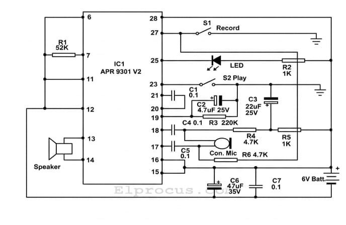
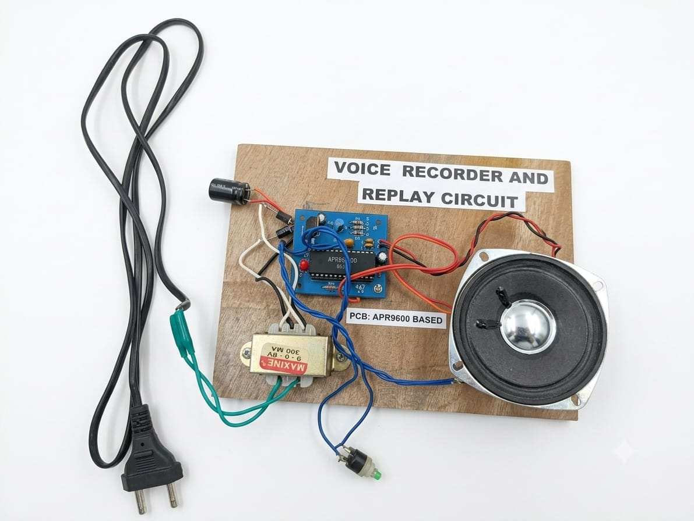

# Voice Recorder and Replay Circuit

## 📌 Project Overview

The Voice Recorder and Replay Circuit is an individual mini project developed as part of my first-semester Electronics and Communication Engineering coursework.

The project focuses on recording and replaying voice signals using the APR9301 voice recorder and playback IC. The circuit provides voice recording and playback through a simple hardware implementation.

## 🎯 Objective

- To design a simple voice recording and playback circuit.
- To understand the basic process of capturing, storing and replaying voice signals.
- To study the working of the APR9301 voice recorder IC.
- To develop a compact and cost-effective electronic circuit.

## 💡 Motivation

Voice recording systems can be useful in several applications such as:

- Security systems
- Assistive technology
- Educational devices
- Medical devices
- Emergency systems
- Event recorders

The project was motivated by the importance of audio recording in practical applications.

## ⚙️ Working Principle

The voice signal is captured through a microphone and processed by the recording circuit.

The voice data is stored in the non-volatile memory of the voice recorder IC. During playback, the stored voice information is retrieved and converted into an audio output through the speaker.

### Basic Flow

Microphone  
↓  
Voice Signal Processing  
↓  
APR9301 Voice Recorder IC  
↓  
Voice Storage  
↓  
Playback  
↓  
Speaker

## 🔧 Hardware Requirements

- APR9301 Voice Recorder IC
- Microphone
- Speaker
- Transformer – 9V
- Power supply
- LED
- Push switches
- Resistors
- Capacitors
- Connecting wires

### Components Listed in the Project

- 1KΩ resistors – 2
- 4.7Ω resistors – 2
- 52KΩ resistor – 1
- 220Ω resistor – 1
- 0.1µF capacitors – 3
- 22µF capacitor – 1
- 4.7µF capacitor – 1
- 47µF capacitor – 1

## 🧠 Key Concept

The APR9301 is a single-chip voice recording and playback device capable of recording and replaying voice signals. It uses non-volatile flash memory technology for storing recorded information.

The project documentation specifies a 5V supply and approximately 25mA operating current.

## 📐 Block Diagram

## 🔧 Final Prototype

## 📊 Results

The developed circuit demonstrated:

- Successful voice recording.
- Voice playback with clear audio output.
- Minimal noise during recording.
- Reliable storage of recorded information.
- Low-power operation.
- A compact and cost-effective circuit implementation.

## 👨‍💻 My Role

**Individual Project**

As this was an individual mini project, I was responsible for the complete project work, including studying the voice recording and playback concept, understanding the APR9301-based circuit, assembling and working with the circuit, documenting the project, and presenting the project.

## 🎓 Learning Outcomes

Through this project, I gained an understanding of:

- Voice signal recording and playback
- Audio signal processing basics
- Voice recorder ICs
- Electronic components and circuit connections
- Non-volatile memory concepts
- Practical circuit development

## 🚀 Future Scope

The basic voice recording concept can be further developed for applications involving:

- Security systems
- Assistive technology
- Educational devices
- Medical applications
- Emergency communication systems

## 🏫 Academic Details

**Department:** Electronics and Communication Engineering  
**Institution:** Jeppiaar Institute of Technology  
**Project:** Mini Project – I  
**Semester:** I
